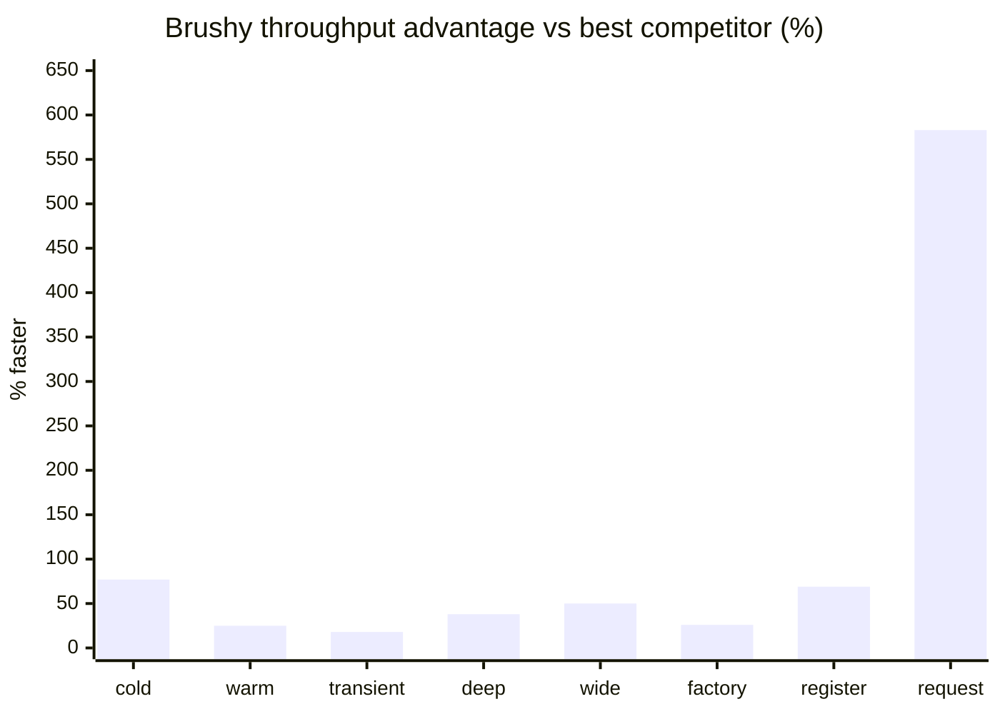

# Benchmarks

**@brushy/di-core ranked #1** among DI libraries (tsyringe, InversifyJS, awilix) in **8/8 scenarios**. Baseline (`new` direct) is measured separately as overhead reference, not ranked against DI runtimes.

## Environment

| Field | Value |
| --- | --- |
| Date | 2026-09-12 |
| Node | v22.23.2 |
| Platform | linux x64 |
| CPUs | 16 × AMD Ryzen 7 5700X 8-Core Processor |
| Config | `time=3000ms`, `runs=5` (full suite) |

<Note>
  Results are indicative. Run benchmarks on an idle machine for stable numbers. They are not a substitute for profiling your own app.
</Note>

<Note>
  Published numbers come from the full suite (`time=3000ms`, `runs=5`). CI on `main` refreshes `BENCHMARK.md` weekly via [`.github/workflows/benchmark.yml`](https://github.com/brushysuite/brushy-librarys/blob/main/.github/workflows/benchmark.yml).
</Note>

## Speed advantage over best competitor



## Throughput (p50) by scenario

| Scenario | @brushy/di-core | Best competitor | Faster | Throughput (relative) |
| --- | --- | --- | --- | --- |
| singleton_cold | 4.52M/s | tsyringe 2.56M/s | **+77%** | `██████████` vs `██████░░░░` |
| singleton_warm | 8.33M/s | awilix 6.67M/s | **+25%** | `██████████` vs `████████░░` |
| transient | 6.21M/s | inversify 5.26M/s | **+18%** | `██████████` vs `████████░░` |
| deep_graph | 12.50M/s | awilix 9.09M/s | **+38%** | `██████████` vs `███████░░░` |
| wide_graph | 12.50M/s | awilix 8.33M/s | **+50%** | `██████████` vs `███████░░░` |
| factory_deps | 8.33M/s | awilix 6.62M/s | **+26%** | `██████████` vs `████████░░` |
| register_batch | 648.09K/s | tsyringe 382.41K/s | **+69%** | `██████████` vs `██████░░░░` |
| request_scope | 3.83M/s | awilix 560.85K/s | **+583%** | `██████████` vs `█░░░░░░░░░` |

`request_scope`: tsyringe and inversify have no native request scope (N/A). Bars are scaled per row (@brushy/di-core = 10 blocks).

## Full results and methodology

- [BENCHMARK.md](https://github.com/brushysuite/brushy-librarys/blob/main/packages/di-bench/results/BENCHMARK.md): executive summary, rankings, and detailed metrics
- [METHODOLOGY.md](https://github.com/brushysuite/brushy-librarys/blob/main/packages/di-bench/METHODOLOGY.md): scenario definitions, adapters, and CI refresh policy
- [latest.json](https://github.com/brushysuite/brushy-librarys/blob/main/packages/di-bench/results/latest.json) / [latest.csv](https://github.com/brushysuite/brushy-librarys/blob/main/packages/di-bench/results/latest.csv): machine-readable exports

## Run locally

Build `@brushy/di-core`, then run the benchmark suite from the project root:

```bash
npm run build-packages
npm run bench:quick
```

For the full CI-equivalent suite (5 runs × 3s per task, updates published artifacts):

```bash
npm run bench:report
```

Partial runs write gitignored `partial-*` files under `packages/di-bench/results/`. Only full runs update `latest.*` and `BENCHMARK.md`.
