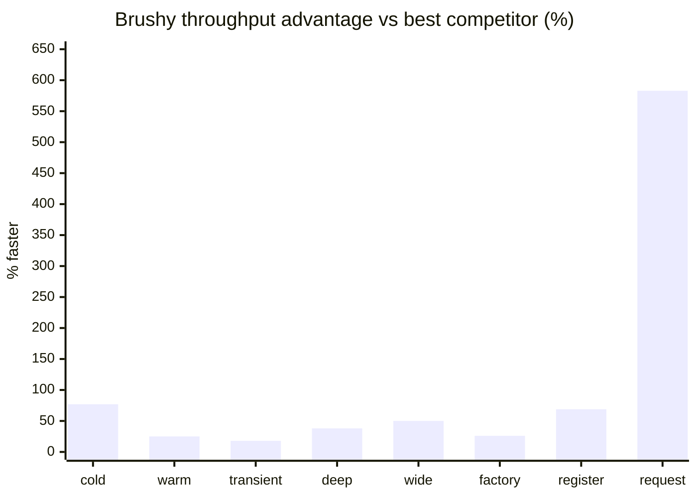

# @brushy/di

<div align="center">

[](coverage)
[](coverage)
[](coverage)
[](coverage)

[](https://www.npmjs.com/package/@brushy/di)
[](https://bundlephobia.com/package/@brushy/di)
[](https://www.npmjs.com/package/@brushy/di)

</div>

Umbrella package for **Brushy DI v2**: typed dependency injection for Node.js, browsers, React, and React Native. Re-exports `@brushy/di-core`, `@brushy/di-react`, and `@brushy/di-monitor` from one install. OpenTelemetry lives in `@brushy/di/otel` (subpath only).

**Documentation:** [brushysuite.gfrancodev.com/docs/di](https://brushysuite.gfrancodev.com/docs/di) · [Full docs (source)](../../apps/docs/di/overview.mdx) · [Example projects](../../examples/README.md)

## Features

- **Lifecycles**: singleton, transient, scoped, immutable
- **Typed tokens**: `createToken`, `deps`, `defineModule`
- **React integration**: `BrushyDIProvider`, `useInject`, `useInjectLazy`, `useInjectComponent`
- **Request scope**: AsyncLocalStorage on Node (`server`, `runInRequestScope`)
- **Observability**: optional monitor and OpenTelemetry subpaths
- **Performance**: #1 among DI runtimes in 8/8 benchmark scenarios ([details](#benchmark))

## Package map (v2)

| Package | Role |
| --- | --- |
| `@brushy/di` | Umbrella (core + react + monitor; otel via subpath) |
| `@brushy/di-core` | Container, tokens, lifecycles, request scope, server facade |
| `@brushy/di-react` | React / React Native hooks and component injection |
| `@brushy/di-monitor` | Container event monitoring and stats |
| `@brushy/di-otel` | OpenTelemetry resolve tracing (optional) |

### Related Brushy libraries

| Package | Role |
| --- | --- |
| `@brushy/storage` | Isomorphic cache (NodeCache-style DX, optional browser persist) |
| `@brushy/storage-react` | React hooks for storage (`useStorage`) |
| `@brushy/localstorage` | **Deprecated.** Use `@brushy/storage` + `@brushy/storage-react` |

Examples combine DI with `@brushy/storage` (see [Vite](../../examples/vite) and [Express](../../examples/express)).

## Installation

**Full stack (recommended)**

```bash
npm install @brushy/di react
```

**By stack**

| Stack | Install |
| --- | --- |
| React web | `npm install @brushy/di react react-dom` |
| React Native | `npm install @brushy/di react` |
| Express / Fastify / API | `npm install @brushy/di-core express` |
| Script / worker | `npm install @brushy/di-core` |
| Monitor (optional) | `npm install @brushy/di-monitor` |
| OpenTelemetry (optional) | `npm install @brushy/di-otel @opentelemetry/api` |

Granular install (without umbrella): `@brushy/di-core` + `@brushy/di-react`. Full setup guide: [Getting Started](../../apps/docs/di/getting-started.mdx).

## Quick start

**Core**

```typescript
import { Container, createToken } from "@brushy/di/core";

const LOGGER = createToken<{ log: (msg: string) => void }>("LOGGER");

const container = new Container();
container.register(LOGGER, { useValue: { log: console.log } });

container.resolve(LOGGER).log("ready");
```

**React**

```tsx
import { Container, createToken } from "@brushy/di/core";
import { BrushyDIProvider, useInject } from "@brushy/di/react";

const container = new Container();
const USER_SERVICE = container.register(createToken("USER_SERVICE"), {
  useClass: UserService,
  lifecycle: "singleton",
});

export function AppProviders({ children }: { children: React.ReactNode }) {
  return <BrushyDIProvider container={container}>{children}</BrushyDIProvider>;
}

function Profile() {
  const users = useInject(USER_SERVICE);
  // ...
}
```

**Express (request scope)**

```typescript
import { server } from "@brushy/di/core";
import { container, USER_SERVICE } from "./container";

server.setServerContainer(container);
app.use(server.brushyRequestScope());

app.get("/api/users", (_req, res) => {
  res.json(server.resolve(USER_SERVICE).list());
});
```

## Entrypoints

| Import path | Contents | Use when |
| --- | --- | --- |
| `@brushy/di` | core + react + monitor | Default full-stack import |
| `@brushy/di/core` | `@brushy/di-core` | Server bundles, tree-shake React out |
| `@brushy/di/react` | `@brushy/di-react` | Client-only React / React Native |
| `@brushy/di/monitor` | `@brushy/di-monitor` | Dev tooling, metrics |
| `@brushy/di/otel` | `@brushy/di-otel` | OpenTelemetry tracing |

```typescript
// Umbrella
import { Container, useInject, BrushyDIProvider, monitor } from "@brushy/di";

// Subpaths (recommended for bundle size)
import { Container, server, defineModule } from "@brushy/di/core";
import { useInject, useInjectComponent } from "@brushy/di/react";
import { monitor } from "@brushy/di/monitor";
import { traceContainer } from "@brushy/di/otel"; // not re-exported from main entry
```

Runtime guide: [Package entrypoints](../../apps/docs/di/entrypoints.mdx).

## Benchmark

**@brushy/di-core ranked #1** among DI libraries (tsyringe, InversifyJS, awilix) in **8/8 scenarios**. Baseline (`new` direct) is measured separately as overhead reference, not ranked against DI runtimes.

**Last run:** 2026-09-12 · Node v22.23.2 · linux x64 · `time=3000ms`, `runs=5` (full suite)

> Published numbers come from the full suite (5 runs × 3s per task). Local quick runs: `npm run bench:quick`; full runs: `npm run bench:report`.

### Speed advantage over best competitor



### Throughput (p50) by scenario

| Scenario | @brushy/di-core | Best competitor | Faster | Throughput (relative) |
| --- | --- | --- | --- | --- |
| singleton_cold | 4.52M/s | tsyringe 2.56M/s | **+77%** | `██████████` vs `██████░░░░` |
| singleton_warm | 8.33M/s | awilix 6.67M/s | **+25%** | `██████████` vs `████████░░` |
| transient | 6.21M/s | inversify 5.26M/s | **+18%** | `██████████` vs `████████░░` |
| deep_graph | 12.50M/s | awilix 9.09M/s | **+38%** | `██████████` vs `███████░░░` |
| wide_graph | 12.50M/s | awilix 8.33M/s | **+50%** | `██████████` vs `███████░░░` |
| factory_deps | 8.33M/s | awilix 6.62M/s | **+26%** | `██████████` vs `████████░░` |
| register_batch | 648.09K/s | tsyringe 382.41K/s | **+69%** | `██████████` vs `██████░░░░` |
| request_scope | 3.83M/s | awilix 560.85K/s | **+583%** | `██████████` vs `█░░░░░░░░░` |

`request_scope`: tsyringe and inversify have no native request scope (N/A). Bars are scaled per row (Brushy = 10 blocks).

Full numbers, methodology, and CI refresh policy: [Benchmarks docs](https://brushysuite.gfrancodev.com/docs/di/benchmarks) · [`BENCHMARK.md`](../di-bench/results/BENCHMARK.md) · [`METHODOLOGY.md`](../di-bench/METHODOLOGY.md)

```bash
npm run bench:quick   # from repository root
```

## Example projects

Runnable demos in [`examples/`](../../examples/README.md):

| Example | Stack | Highlights |
| --- | --- | --- |
| [vite](../../examples/vite) | Vite + React | `useInject`, `@brushy/storage-react` |
| [expo](../../examples/expo) | Expo + RN | same + RN error renderer |
| [express](../../examples/express) | Express | `brushyRequestScope`, scoped services |
| [fastify](../../examples/fastify) | Fastify | `runInRequestScopeAsync` |

```bash
npm run build-packages
npm run example:vite      # http://localhost:5173
npm run example:express   # http://localhost:3001/users
npm run example:fastify   # http://localhost:3002/users
```

## Migration from v1

v2 splits the library into focused packages. The umbrella import still works; prefer subpaths or granular packages for tree-shaking.

```typescript
// v1
import { Container, useInject, monitor } from "@brushy/di";

// v2 (umbrella, same ergonomics)
import { Container, useInject, monitor, createToken } from "@brushy/di";

// v2 (granular)
import { Container, createToken } from "@brushy/di-core";
import { useInject, BrushyDIProvider } from "@brushy/di-react";
```

Breaking changes: `useLazyInject` → `useInjectLazy`; typed tokens via `createToken` (avoid string tokens). Full guide: [Migration v2](../../apps/docs/di/migration-v2.mdx).

## Documentation

| Topic | Link |
| --- | --- |
| Overview | [apps/docs/di/overview.mdx](../../apps/docs/di/overview.mdx) |
| Getting Started | [apps/docs/di/getting-started.mdx](../../apps/docs/di/getting-started.mdx) |
| Container & modules | [apps/docs/di/container.mdx](../../apps/docs/di/container.mdx) |
| Server & request scope | [apps/docs/di/server.mdx](../../apps/docs/di/server.mdx) |
| React hooks | [apps/docs/di/react-hooks.mdx](../../apps/docs/di/react-hooks.mdx) |
| Component injection | [apps/docs/di/component-injection.mdx](../../apps/docs/di/component-injection.mdx) |
| Best practices | [apps/docs/di/best-practices.mdx](../../apps/docs/di/best-practices.mdx) |
| Benchmarks | [apps/docs/di/benchmarks.mdx](../../apps/docs/di/benchmarks.mdx) · [Published docs](https://brushysuite.gfrancodev.com/docs/di/benchmarks) |
| Monitor | [apps/docs/di/monitor/overview.mdx](../../apps/docs/di/monitor/overview.mdx) |

Local docs site: `npm run docs:dev` from the repository root (Mintlify in `apps/docs`).

## Related packages

| Package | README |
| --- | --- |
| `@brushy/di-core` | [packages/di-core/README.md](../di-core/README.md) |
| `@brushy/di-react` | [packages/di-react/README.md](../di-react/README.md) |
| `@brushy/di-monitor` | [packages/di-monitor/README.md](../di-monitor/README.md) |
| `@brushy/di-otel` | [packages/di-otel/README.md](../di-otel/README.md) |
| `@brushy/storage` | [packages/storage/README.md](../storage/README.md) |

## License

MIT
