# @brushy/di

<div align="center">

[](coverage)
[](coverage)
[](coverage)
[](coverage)

<!-- Package Stats -->

[](https://www.npmjs.com/package/@brushy/di)
[](https://bundlephobia.com/package/@brushy/di)
[](https://www.npmjs.com/package/@brushy/di)

</div>

A powerful and flexible dependency injection system for JavaScript/TypeScript applications, with special support for React.

[🇧🇷 Documentação em Português](https://brushysuite.gfrancodev.com/docs/di/provider)

## Features

- 🔄 **Flexible Lifecycle**: Singleton, Transient and Scoped
- 🧩 **Component Injection**: Swappable UI modules via `useInjectComponent` (themes, white-label)
- 🔍 **Observability**: Detailed monitoring and logging
- 🚀 **Performance**: #1 among DI runtimes in 8/8 benchmark scenarios. See [Benchmark](#benchmark).
- 🧪 **Testability**: Easy to mock for testing
- 📦 **Modular**: Organization in independent modules

## Benchmark

**@brushy/di-core ranked #1** among DI libraries (tsyringe, InversifyJS, awilix) in **8/8 scenarios** (throughput p50, 3 runs × 1000ms, Node v25, linux x64). Baseline (`new` direct) is measured separately as overhead reference, not ranked against DI runtimes.

**Scenarios measured** (`packages/di-bench`):

- `singleton_cold`: register + first resolve in a fresh container each iteration
- `singleton_warm`: repeated resolve with a warm singleton cache
- `transient`: new instance on every resolve
- `deep_graph`: linear chain A→B→C→D→E (5 levels)
- `wide_graph`: hub service with 5 parallel dependencies
- `factory_deps`: factory provider with 2 injected dependencies
- `register_batch`: register 50 providers in one batch
- `request_scope`: scoped resolve per request (brushy + awilix; tsyringe/inversify N/A)

```mermaid
xychart-beta
    title "Throughput p50: @brushy/di-core vs 2nd place (M ops/s)"
    x-axis ["cold", "warm", "transient", "deep", "wide", "factory", "scope"]
    y-axis "M/s" 0 --> 17
    bar "brushy" [4.74, 9.09, 6.25, 14.29, 16.39, 9.90, 3.83]
    bar "2nd place" [2.62, 6.67, 5.24, 9.09, 9.09, 6.67, 0.59]
```



`register_batch`: brushy **674K/s** vs tsyringe 388K/s (2nd), also #1.

Full numbers and methodology: [`latest.md`](../di-bench/results/latest.md) · [`METHODOLOGY.md`](../di-bench/METHODOLOGY.md)

```bash
npm run bench:quick
```

## Installation

Default install (full stack):

```bash
npm install @brushy/di
```

Stack-specific commands and optional packages are in [Getting Started](#getting-started) below. Detailed setup: [docs (EN)](./docs/en/getting-started.md) · [docs (PT)](./docs/pt-br/getting-started.md).

## Getting Started

Copy the install command for your stack. Detailed setup (providers, middleware, App Router): [Getting Started (EN)](./docs/en/getting-started.md) · [Primeiros passos (PT)](./docs/pt-br/getting-started.md)

**Full stack / Next.js**

```bash
npm install @brushy/di next react react-dom
```

**React web**

```bash
npm install @brushy/di react react-dom
```

**React Native**

```bash
npm install @brushy/di react
```

**Express / Fastify / API**

```bash
npm install @brushy/di-core express
```

```bash
npm install @brushy/di-core fastify
```

**Script / worker**

```bash
npm install @brushy/di-core
```

**Optional - monitor & OpenTelemetry**

```bash
npm install @brushy/di-monitor @brushy/di-otel
```

## Cross-platform

Copy the import for your runtime. Patterns and lifecycle details: [Getting Started (EN)](./docs/en/getting-started.md) · [Primeiros passos (PT)](./docs/pt-br/getting-started.md)

**React (web client)**

```typescript
import { BrushyDIProvider, useInject } from "@brushy/di/react";
```

**React Native**

```typescript
import { BrushyDIProvider, useInject } from "@brushy/di/react";
```

**Server (Node, SSR, Route Handlers)**

```typescript
import { Container, server, runInRequestScope } from "@brushy/di/core";
```

**Server - request scope middleware (Express / Connect)**

```typescript
import { server } from "@brushy/di/core";

app.use(server.brushyRequestScope());
```

### Entrypoints

**Umbrella (core + react + monitor + otel)**

```typescript
import { Container, useInject, BrushyDIProvider } from "@brushy/di";
```

**Core only**

```typescript
import { Container, createToken, server } from "@brushy/di/core";
```

**React only**

```typescript
import { BrushyDIProvider, useInject, useInjectComponent } from "@brushy/di/react";
```

**Monitor**

```typescript
import { monitor } from "@brushy/di/monitor";
```

**OpenTelemetry**

```typescript
import { traceContainer } from "@brushy/di/otel";
```

## Real-World Problem Solving

Here's how @brushy/di compares to other solutions in solving common real-world problems:

| Problem                 | @brushy/di                                  | tsyringe                 | InversifyJS              | Angular DI                |
| ----------------------- | ------------------------------------------- | ------------------------ | ------------------------ | ------------------------- |
| **React Integration**   | ✅ Native support with hooks and components | ⚠️ Requires manual setup | ❌ Limited React support | ❌ Not designed for React |
| **Server Components**   | ✅ Context-first on client; core on server | ❌ Not compatible        | ❌ Not compatible        | ❌ Not applicable         |
| **Promise Caching**     | ✅ Automatic smart caching                  | ⚠️ Manual implementation | ⚠️ Manual implementation | ⚠️ Manual implementation  |
| **Component Injection** | ✅ Built-in UI component system             | ❌ No UI support         | ❌ No UI support         | ⚠️ Different paradigm     |
| **Learning Curve**      | ✅ Moderate                                 | ✅ Moderate              | ❌ Steep                 | ❌ Steep                  |
| **Scope Management**    | ✅ Built-in request/session scopes          | ❌ No scope support      | ⚠️ Basic scopes          | ✅ Built-in scopes        |
| **Performance**         | ✅ Optimized resolution                     | ✅ Fast resolution       | ⚠️ Moderate              | ❌ Heavy runtime          |

Legend:

- ✅ Fully Supported
- ⚠️ Partially Supported
- ❌ Not Supported/Limited

## Examples

### React (web or client bundle)

The main React advantage is **component injection**: register UI modules by token and swap implementations (themes, white-label, A/B) without changing the shell.

Register components on the **container** with `container.register(createToken("…"), { useValue })` or `new Container({ providers })`. Tokens are **`Symbol`** via `createToken` (never strings). Wrap with `BrushyDIProvider`, resolve UI with `useInjectComponent`. Domain services live in **`defineModule`** bundles:

```typescript
// modules/catalog.module.ts
import { defineModule } from "@brushy/di/core";

class CatalogApi {
  async listProducts() {
    const res = await fetch("/api/products");
    return res.json();
  }
}

export const catalogModule = defineModule({
  catalogApi: { useClass: CatalogApi, lifecycle: "singleton" },
});
```

```typescript
// di/container.ts
import { Container, createToken } from "@brushy/di/core";
import { catalogModule } from "../modules/catalog.module";
import { AcmeHeader } from "../themes/acme/acme-header";
import { AcmeSidebar } from "../themes/acme/acme-sidebar";

export const container = new Container({ name: "app" });

export const SIDEBAR = container.register(createToken("SIDEBAR"), {
  useValue: AcmeSidebar,
});
export const HEADER = container.register(createToken("HEADER"), {
  useValue: AcmeHeader,
});

catalogModule.register(container);
export const CATALOG_API = catalogModule.tokens.catalogApi;
```

Declarative equivalent (same tokens, no extra typing required):

```typescript
const sidebarToken = createToken("SIDEBAR");
const headerToken = createToken("HEADER");

export const container = new Container({
  name: "app",
  providers: [
    { provide: sidebarToken, useValue: AcmeSidebar },
    { provide: headerToken, useValue: AcmeHeader },
  ],
});

export const SIDEBAR = sidebarToken;
export const HEADER = headerToken;
```

To swap themes, replace the `Acme*` imports (or `container.import` a theme child container).

```tsx
// app/providers.tsx
"use client";

import { BrushyDIProvider } from "@brushy/di/react";
import { container } from "../di/container";

export function AppProviders({ children }: { children: React.ReactNode }) {
  return <BrushyDIProvider container={container}>{children}</BrushyDIProvider>;
}
```

```tsx
// components/app-shell.tsx
import { useInjectComponent } from "@brushy/di/react";
import { HEADER, SIDEBAR } from "../di/container";

export function AppShell({
  title,
  children,
  onNavigate,
}: {
  title: string;
  children: React.ReactNode;
  onNavigate: (path: string) => void;
}) {
  const Sidebar = useInjectComponent(SIDEBAR);
  const Header = useInjectComponent(HEADER);

  return (
    <div className="layout">
      <Sidebar onNavigate={onNavigate} />
      <main>
        <Header title={title} />
        {children}
      </main>
    </div>
  );
}
```

```tsx
// components/product-list.tsx
import { useEffect, useState } from "react";
import { useInject } from "@brushy/di/react";
import { CATALOG_API } from "../di/container";

export function ProductList() {
  const catalog = useInject(CATALOG_API);
  const [products, setProducts] = useState<{ id: string; name: string }[]>([]);

  useEffect(() => {
    catalog.listProducts().then(setProducts);
  }, [catalog]);

  return (
    <ul>
      {products.map((p) => (
        <li key={p.id}>{p.name}</li>
      ))}
    </ul>
  );
}
```

Use `useInject` + **`defineModule`** for services. Use `useInjectComponent` with components registered via **`container.register`** or **`new Container({ providers })`**. React Native: `setInjectComponentErrorRenderer` for dev errors. See [Component Injection](./docs/en/component-injection.md).

Next.js App Router: keep providers and `useInjectComponent` in Client Components; resolve services on the server via `@brushy/di/core`. See [Getting Started](./docs/en/getting-started.md).

### Modules (`defineModule` + `import`)

Organize providers into typed feature modules and compose the app container:

| API | When to use |
| --- | --- |
| **`defineModule`** | Typed bundle: `module.register(container)` + `module.tokens.*` (inferred types) |
| **`container.import`** | Merge a child container (with internal `deps`) into the root app |

```typescript
// modules/users.module.ts: child container with internal dependencies
import { Container, createToken, deps } from "@brushy/di/core";

class UserRepository {
  findAll() {
    return [{ id: "1", name: "Ada" }];
  }
}

class UserService {
  constructor(private repo: UserRepository) {}
  list() {
    return this.repo.findAll();
  }
}

export const usersContainer = new Container({ name: "users" });

const USER_REPO = usersContainer.register(createToken<UserRepository>("USER_REPO"), {
  useClass: UserRepository,
  lifecycle: "scoped",
});

export const USER_SERVICE = usersContainer.register(createToken<UserService>("USER_SERVICE"), {
  useClass: UserService,
  dependencies: deps([USER_REPO]),
  lifecycle: "scoped",
});
```

```typescript
// modules/audit.module.ts: flat module via defineModule
import { defineModule } from "@brushy/di/core";

class AuditLogger {
  log(action: string) {
    console.log(`[audit] ${action}`);
  }
}

export const auditModule = defineModule({
  audit: { useClass: AuditLogger, lifecycle: "singleton" },
});
```

```typescript
// di/container.ts: compose modules into one app container
import { Container } from "@brushy/di/core";
import { auditModule } from "../modules/audit.module";
import { usersContainer, USER_SERVICE } from "../modules/users.module";

export const container = new Container({ name: "app" });

container.import(usersContainer);
auditModule.register(container);

export { USER_SERVICE, auditModule };
```

`createBrushyApp` is a shortcut when you bootstrap a single root module: `const { container, module } = createBrushyApp({ auth: { useClass: AuthService } })`.

### Backend (Express + request scope)

Register **scoped** services for per-request isolation, attach `brushyRequestScope` middleware, resolve through the `server` facade (using the composed container from [Modules](#modules-definemodule--import) above):

```typescript
// server.ts
import express from "express";
import { server } from "@brushy/di/core";
import { container, USER_SERVICE } from "./di/container";

server.setServerContainer(container);

const app = express();
app.use(server.brushyRequestScope());

app.get("/api/users", (_req, res) => {
  res.json(server.resolve(USER_SERVICE).list());
});

app.listen(3000);
```

Each request gets its own `UserRepository` / `UserService` instance. For Fastify or async handlers, use `runInRequestScope` / `runInRequestScopeAsync`. See [Server utilities](./docs/en/server.md).

Full guides: [Container](./docs/en/container.md) · [React Hooks](./docs/en/react-hooks.md) · [Server](./docs/en/server.md) · [Component Injection](./docs/en/component-injection.md)

View docs locally:

```bash
npm run docs
```

## Common Use Cases

See the docs for complete examples:

- [Container & modules](./docs/en/container.md) - modular apps, `import()`, lifecycles
- [Server & request scope](./docs/en/server.md) - Express, Next.js Route Handlers, ALS
- [Component injection & theming](./docs/en/component-injection.md) - `useInjectComponent`, providers
- [React Hooks](./docs/en/react-hooks.md) - `useInject`, `useInjectLazy`
- [Best practices](./docs/en/best-practices.md) - tokens, scopes, testing

## License

MIT
